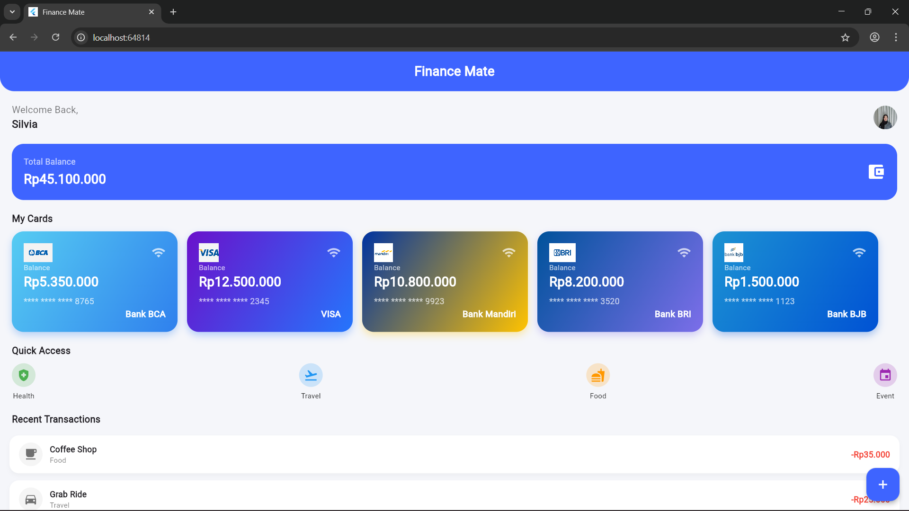

# Finance App

A Flutter project created for the Mobile Programming course.

---

## 📱 UI/UX Screenshots

### uiux1

### uiux2

---

## 🚀 Getting Started

This project is a starting point for Flutter application development.

Here are some useful resources:

- [Codelab: Write your first Flutter app](https://docs.flutter.dev/get-started/codelab)
- [Cookbook: Useful Flutter samples](https://docs.flutter.dev/cookbook)

For detailed Flutter documentation, visit the  
[official Flutter docs](https://docs.flutter.dev/).

---
